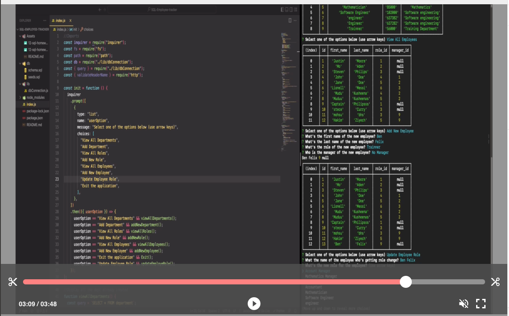

# SQL-Employee-tracker

Following the user story below, I created an application that allows any manager to track their employees very easily.

```md
AS A business owner
I WANT to be able to view and manage the departments, roles, and employees in my company
SO THAT I can organize and plan my business
```

### App Features

This app allows any manager to do all the following functions.

- View All Departments
- Add Department
- View All Roles
- Add New Role
- Update Employee Role
- View All Employees
- Add New Employee
- Exit The Application

To run the application, use the following commands below ⤵️

```
npm i
npm start
```

### Watch the video below for the Demo ⤵️

[](https://drive.google.com/file/d/1W7ziVVTdBCSILfB68pg5fqO6xzG7An1j/view "SQL Employee tracker")
